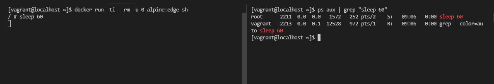
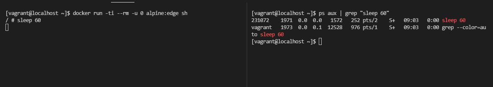

## Poblem


## Create user.
```bash
sudo adduser --system --no-create-home  container
```

## Append the /etc/subgid & /etc/subuid files.

```bash
sudo echo "container:231072:65536" >>  /etc/subuid
sudo echo "container:231072:65536" >> /etc/subgid
```

## Edit /etc/docker/daemon.json, and add the userns-remap config line.
```json
{   
    "bip": "192.168.255.1/24",
    "userns-remap": "container:container",
    "debug": false
}
```

## Enable user namespace on the kernel.
```bash
sudo echo 99 > /proc/sys/user/max_user_namespaces
```

## Restart docker.
```bash
sudo systemctl restart docker.service
```
## Test

### Login into the terminal of the container.
```bash
docker run -ti --rm -u 0 alpine:edge sh
```

### Run the following command within the container itself.
```sh
sleep 60
```
### Open another window and run the following command on the host.
```bash
ps aux | grep "sleep 60"
```

## Result

